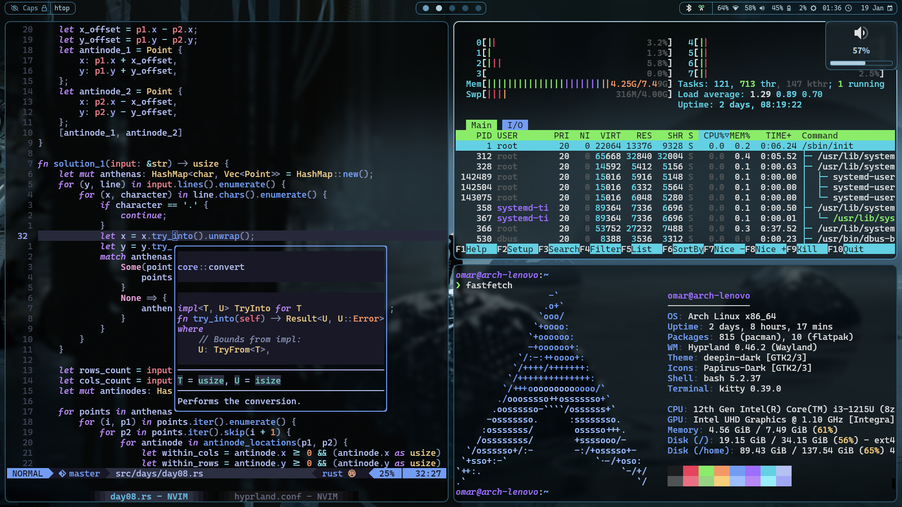

# Dotfiles

Dotfiles and installation scripts for my Arch Linux setup.

<details open>
  <summary>Desktop (Hyprland + waybar)</summary>



</details>

<details>
  <summary>Screen lock (Hyprlock)</summary>


</details>

## Setup

Dependencies:

- `git`
- `stow`

On a fresh installation of Arch, clone this repository.

```sh
git clone https://github.com/ValdezFOmar/.dotfiles.git ~/.dotfiles
```

Then run the installation script for user and system configurations, in
that order:

```sh
cd ~/.dotfiles/
./install.sh
sudo ./etc/install.sh
```

> [!WARNING]
> This will download and install multiple packages, create directories
> on `~/`, symlink user configuration files, replace some system
> configuration files and enable some services.
>
> For only installing user configuration files run:
>
> ```bash
> cd ~/.dotfiles && stow --verbose --dotfiles home
> ```
